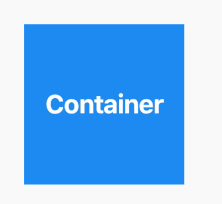

# What Are Buttons in Flutter?

**Definition:** Buttons are interactive elements that allow users to perform an action when pressed. In Flutter, buttons come in various types and offer a wide range of customization options.

**Purpose:** Buttons are essential for navigation, submitting forms, or triggering other actions within the app.

# Types of Buttons in Flutter

## ElevatedButton

**Definition:** A button that appears raised above the interface, giving it a sense of depth.

**Use Case:** Use when you need to draw attention to the action or when the button is placed in a flat UI and needs to stand out.

```dart
ElevatedButton(
  style: ElevatedButton.styleFrom(
    primary: Colors.blue, // Background color
    onPrimary: Colors.white, // Text color
    padding: EdgeInsets.symmetric(horizontal: 30, vertical: 15),
    shape: RoundedRectangleBorder(
      borderRadius: BorderRadius.circular(10),
    ),
  ),
  onPressed: () {},
  child: Text('Custom Elevated Button'),
);
```

## TextButton

**Definition:** A button that appears flat without elevation.

**Use Case:** Use in situations where the action is less prominent, like in dialog actions or secondary tasks.

```dart
TextButton(
  style: TextButton.styleFrom(
    primary: Colors.red, // Text color
    padding: EdgeInsets.all(16),
  ),
  onPressed: () {},
  child: Text('Custom Text Button'),
);
```

## OutlinedButton

**Definition:** A button that has an outline but no background fill.

**Use Case:** Use when you want a less prominent button that still needs a visible border, such as in settings or forms.

```dart
OutlinedButton(
  style: OutlinedButton.styleFrom(
    side: BorderSide(color: Colors.green, width: 2), // Border color
    primary: Colors.green, // Text color
  ),
  onPressed: () {},
  child: Text('Custom Outlined Button'),
);
```

## FloatingActionButton

**Definition:** A button used to perform a primary action, typically floating above the UI.

**Use Case:** Commonly used in the bottom right corner of apps for actions like "add", "edit", or "compose".

```dart
FloatingActionButton(
  backgroundColor: Colors.purple,
  shape: RoundedRectangleBorder(
    borderRadius: BorderRadius.circular(15),
  ),
  onPressed: () {},
  child: Icon(Icons.add),
);
```

## IconButton

**Definition:** A button that only displays an icon and is typically used for toolbar actions or in places where space is limited.

**Use Case:** Commonly used in app bars, navigation, or as action buttons.

```dart
IconButton(
  icon: Icon(
    Icons.star,
    color: Colors.orange,
    size: 30,
  ),
  onPressed: () {},
);
```

## ButtonBar

**Definition:** A container for grouping buttons horizontally.

**Use Case:** Often used in dialogs or forms to align action buttons

```dart
ButtonBar(
  alignment: MainAxisAlignment.center,
  children: [
    ElevatedButton(
      onPressed: () {},
      child: Text('OK'),
    ),
    OutlinedButton(
      onPressed: () {},
      child: Text('Cancel'),
    ),
  ],
);
```

## ElevatedButton with Icon

Combines an icon with a label on a button.

```dart
ElevatedButton.icon(
  onPressed: () {},
  icon: Icon(Icons.send),
  label: Text("Send"),
);
```

## Custom Buttons By InkWell & GestureDetector

```dart
InkWell(
  onTap: () {
    print('Custom Button Tapped');
  },
  child: Container(
    padding: EdgeInsets.symmetric(horizontal: 20, vertical: 10),
    decoration: BoxDecoration(
      color: Colors.blue,
      borderRadius: BorderRadius.circular(10),
    ),
    child: Text(
      'Custom InkWell Button',
      style: TextStyle(color: Colors.white),
    ),
  ),
);
```

### Difference between Gesture Detector and Inkwell

- Gesture Detector provides more controls like dragging, pinch, and swipe.

- Inkwell allows you to decorate how your widget responds when being interacted with. If you are trying to get that ripple effect when you click on let’s say a button then I’d advise you to use the Inkwell widget. 

<center></center>

# Button States

Buttons can have various states, including:

**Enabled:** A button that can be pressed and triggers an action.

**Disabled:** A button that is grayed out and non-interactive, often because the onPressed function is `null`.

```dart
ElevatedButton(
  onPressed: null, // This disables the button
  child: Text('Disabled Button'),
);
```
